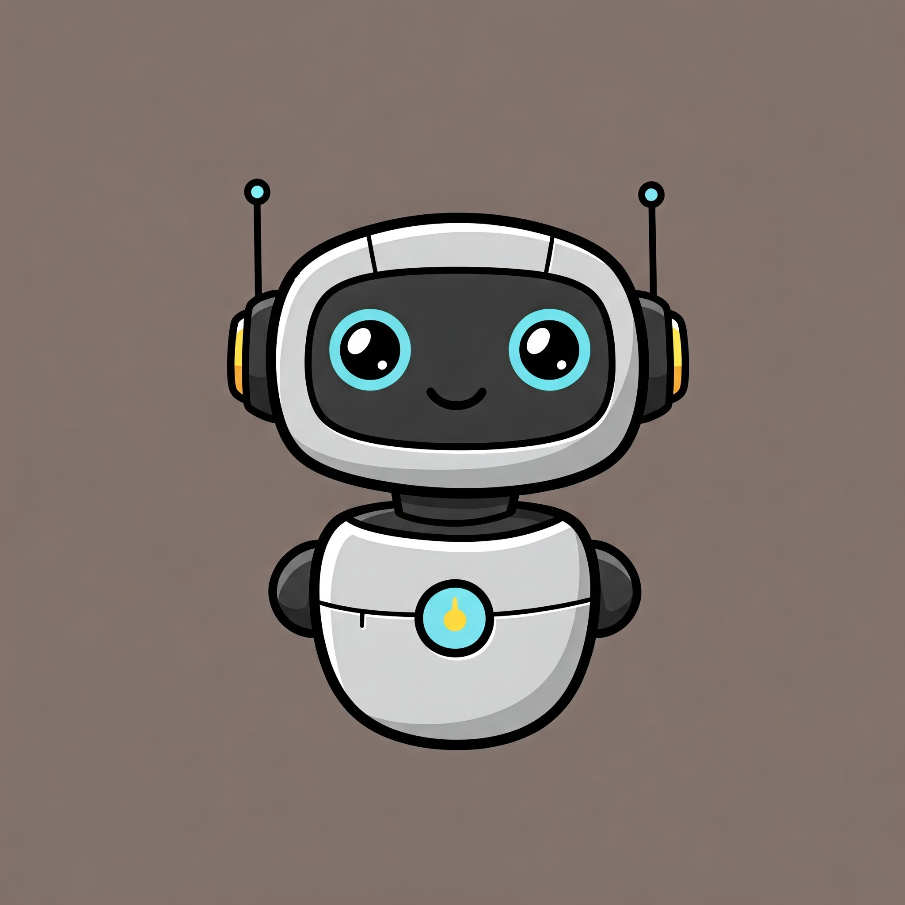

# DBot (prototype)

<p align="center">

</p>

## Overview

Direct を使いこなすマルチモーダル AI アシスタント

ローカルで動きます。

下記の機能を利用可能です。

- メッセージ応答
- アクションスタンプ作成
- ノート作成
- 画像理解

## Get started

daab が installed されていることを前提としています。

### 1. Install Ollama

Ollama とはローカルで LLM を動かすためのツールです。

### 2. Install Ollama model

```bash
ollama run gemma3:4b

or

ollama run gemma3:12b
```

### 3. Install dependencies

```bash
npm install
```

### 4. Run the daab

daab 用のアカウントを作って自分の組織に招待してください。

```bash
daab login

daab run
```

### 5. Let's start a conversation

bot とのペアトークを開始しましょう!

### Oprtions

edit .env file
.env.example をコピーして .env にリネームしてください。

```bash
// これは自動設定されます
HUBOT_DIRECT_TOKEN=xxx
// gemma3:4b or gemma3:12b or gemma3:27b  PCのメモリが許す限り大きなものを選択可能 マルチモーダルモデルがおすすめ gemma以外でも大丈夫
OLLAMA_MODEL=gemma3:12b
// なくても動くきます。お好きなように
DEFAULT_INSTRUCTION=お嬢様言葉で返答する
```

おすすめモデル(2025 年 5 月時点)

- gemma3:4b(デフォルト)
  - gemma3:12b よりも性能が劣りますが、比較的低負荷で高速です
- gemma3:12b
  - gemma3:4b だと性能不足で direct の機能を十分に活用できません。
  - メモリ 16GB 以上がお勧めです。
- gemma3:27b
  - god mode
  - gemma3:12b よりもさらに高性能ですが、メモリ 32GB 以上が必要です。

## 使い方

### 1. メッセージ応答

- 直接メッセージを送信することで、bot に質問できます。

### 2. アクションスタンプ作成

- bot にアクションスタンプを作成するように指示します。
- 例えば、「晩御飯のメニューを列挙してアンケートを作って」とメッセージを送信します。

### 3. ノート作成

- bot にノートを作成するように指示します。
- 例えば、「React についてまとめておいて」とメッセージを送信します。
- これには時間がかかりますが、bot がノートを作成してくれます。

### 4. 画像理解

- bot に画像を送信することで、画像を理解してもらうことができます。
- 例えば、「画像を添付し、この画像の中に何があるか教えて」とメッセージを送信します。
- ファイルの安全性検証のため、これには時間がかかります
